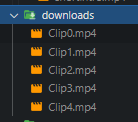

# Twitch Clips to Video (Refactor in Golang)

## This project is a tool to automatically create compilation videos from Twitch clips for a specific game. It consists of a Golang backend that queries the Twitch API to find recent clips for a game, and the FFMPEG go package for video editing scripts that filters the clips and stitches together clips into a full video.

## Motivation
- ### Learn Golang: 
This project served as an opportunity to learn more about Golang development coming from a JavaScript background. I wanted to understand the differences in language syntax, built-in libraries, concurrency models, and overall structure of Golang apps.

- ### Simplify Video Processing
My original Node.js application relied on the YouTube API and Remotion for video editing, which introduced more complexity than needed. By switching to FFMPEG in Golang, I was able to simplify the video processing portion dramatically.

- ### Understand Golang Concurrency
Golang's goroutines and channels provide built-in concurrency primitives that enable efficient parallelism. This project gave me hands-on experience using these tools to speed up tasks like fetching clips concurrently from the Twitch API.

## Features
- Fetch recent clips for a game from Twitch API.
- Download clips locally.
- Add video filter with the broadcaster name in it.
- Compile and stitch clips into a full video.
- Output video in mp4 format.

## Technologies:
- Golang (fmt, io, net/http, os, sync, time, encoding/json)
- FFMPEG-GO package (github.com/u2takey/ffmpeg-go)
- Twitch API (Token Auth and Helix Games)

## App Example

I run the commmand: 
```bash 
go run ./src/
```

Input the Parameters

```bash 
Game name: Fortnite
Clip size: 20 
Days before: 7
```

Then the clips will start to download locally:

